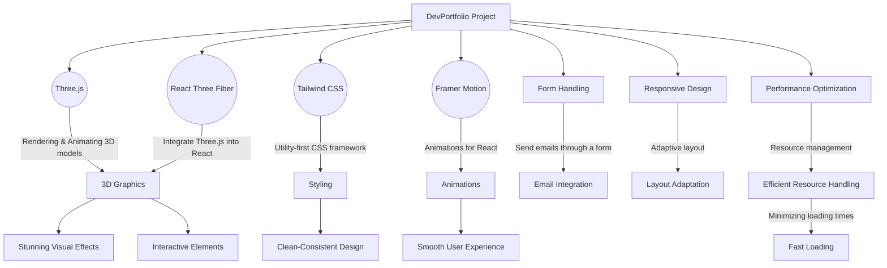

# Portfolio Website Project - Readme

Welcome to my DevPortfolio project! This project was created as part of a course to learn various web development technologies and techniques. The portfolio website showcases my skills, projects, and experiences in an interactive and visually appealing manner.

## Technologies and Libraries

Throughout this course, I have learned and used the following technologies and libraries to build my  portfolio website:

1. **Three.js**:
   Three.js is a powerful 3D graphics library that enables rendering and animating 3D models. It allows me to create stunning visual effects and interactive elements on the website.

2. **React Three Fiber**:
   React Three Fiber is a popular library that integrates Three.js into React, making it easier to create 3D graphics within a React application. It empowers me to build complex 3D scenes and components using familiar React syntax.

3. **Tailwind CSS**:
   Tailwind CSS is a popular utility-first CSS styling framework. It offers a set of utility classes that allow me to rapidly style and design elements with minimal CSS code. This helped me achieve a clean and consistent design for the website.

4. **Framer Motion**:
   Framer Motion is a widely-used animation library for React. With Framer Motion, I was able to bring life to the website with smooth and engaging animations. Animations make the user experience more delightful and captivating.

## Key Learning Objectives

In this project, I have accomplished the following key learning objectives:

- **3D Modeling and Rendering**:
  I have learned how to load, create, and customize stunning 3D models and geometries using Three.js. I gained an understanding of applying various lights and setting up a camera to position objects in 3D space.

- **React Best Practices**:
  I applied best practices in React development, including the use of Higher Order Components (HOCs) and other design patterns to create reusable and scalable code. This helps maintain a clean and organized codebase.

- **Form Handling**:
  I implemented a form on the website to allow users to contact me through email. I learned how to handle form submissions and set up email integration to receive messages from visitors.

- **Responsive Design**:
  Ensuring the website looks great on all devices is crucial. I learned how to make the website fully responsive, adapting its layout and design to various screen sizes.

- **Performance Optimization**:
  To improve the website's performance, I utilized techniques like Suspense and Preload to manage resources efficiently and minimize loading times.

---